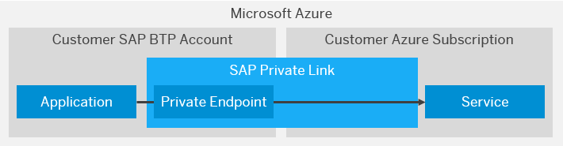

<!-- loioe9cc67716a3a41c9885862661e6c4234 -->

# Consume Azure Native Services in SAP BTP

SAP Private Link service \(Beta\) establishes a private connection between selected SAP SAP BTP services and selected services in your own Microsoft Azure subscriptions.

<a name="loioe9cc67716a3a41c9885862661e6c4234__section_mpr_tmz_cpb"/>

## Overview

To privately access a service in your Azure subcription, SAP Private Link service \(Beta\) creates a private endpoint and reuses the private link functionality of Azure:

  

<a name="loioe9cc67716a3a41c9885862661e6c4234__section_sll_bjz_cpb"/>

## Prerequisites

-   See [Initial Setup](Initial_Setup_f2dce1d.md).

-   You have created an Microsoft Azure service in the Azure Portal.

<a name="loioe9cc67716a3a41c9885862661e6c4234__section_slk_1jz_cpb"/>

## Supported Services

The following Azure native services can be consumed from SAP BTP:

-   Azure Private Link Service

<a name="loioe9cc67716a3a41c9885862661e6c4234__section_zg3_cjz_cpb"/>

## Tutorial

To learn how to connect the SAP Private Link service \(Beta\) to Microsoft Azure, see [Connect SAP Private Link Service to Microsoft Azure Private Link Service with Cloud Foundry CLI](https://developers.sap.com/tutorials/private-link-microsoft-azure.html).

