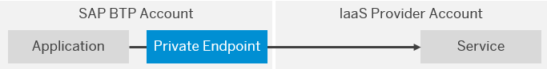

<!-- loio6c7c8a9282e344979295efb882637cd4 -->

# Concepts

Get to know the basic terms of the SAP Private Link service.

<a name="loio6c7c8a9282e344979295efb882637cd4__section_wwc_5hz_cpb"/>

## Components

To privately access a service in your **IaaS Provider account**, the SAP Private Link service creates a **private endpoint** that establishes a point-to-site connection between SAP BTP and the service:

  

 IaaS Provider Account
 :   The account that contains the selected service to which you want to establish a private connection for a selected service from your application running on SAP BTP.

  Private Endpoint
 :   A connection point that provides an internal IP address to an IaaS provider service in your own IaaS provider account that would normally only be accessible via a public IP address.

 

<a name="loio6c7c8a9282e344979295efb882637cd4__section_zby_5hz_cpb"/>

## Establishing a Private Connection

To establish the private connection, you first create a **service instance** of the SAP Private Link service by providing the **identifier** of the IaaS provider service instance. After **approving** the creation of the private endpoint in your IaaS provider account, you **bind** the service instance to your application and can then start using the private endpoint.

However, this binding does not include any credentials for accessing the service in your own IaaS account. You need to provide the credentials to your application by different means, for example, by creating a user-provided service that contains the required information, and binding it to the application.

  

 Service Identifier
 :   The unique identifier of a service instance of an IaaS provider service that has to be provided during the creation of the SAP Private Link service instance. The actual term depends on the IaaS provider, for example, in Azure, this unique service identifier is called *service resource*.

  Service Instance
 :   Creating a service instance of the SAP Private Link service sets up a private endpoint that is associated with this service instance.

  Binding
 :   Binding the service instance of the SAP Private Link service to the application gives the Cloud Foundry space access to the private endpoint. Binding the user-provided service to the application shares the service credentials with the application.

  Credentials
 :   Creating a user-provided service, for example, enables you to share the credentials of the bound service instance in the IaaS provider account with the application in your SAP BTP account.

 

> ### Note:  
> Depending on the IaaS provider, you might need to perform additional steps. For more information, see [Using SAP Private Link Service](using-sap-private-link-service/using-sap-private-link-service-3672119.md).

