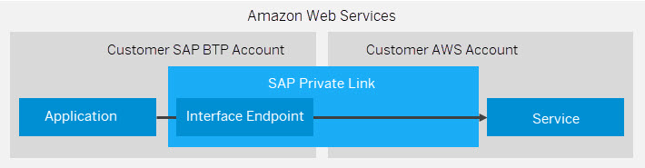

<!-- loio575341947b854a82a9f3ba2bc6b1b6cc -->

# Consume Amazon Web Services in SAP BTP

SAP Private Link service establishes a private connection between selected SAP BTP services and selected services in your own Amazon Web Service \(AWS\) accounts.

<a name="loio575341947b854a82a9f3ba2bc6b1b6cc__section_ky5_rwr_45b"/>

## Overview

To privately access a service in your AWS accounts, SAP Private Link service creates an AWS interface endpoint and reuses the private link functionality of AWS:

<a name="loio575341947b854a82a9f3ba2bc6b1b6cc__section_b45_53s_45b"/>

## Prerequisites

-   See [Initial Setup](https://help.sap.com/docs/PRIVATE_LINK/42acd88cb4134ba2a7d3e0e62c9fe6cf/f2dce1d43acb4771beee7304b464041e.html?locale=en-US&version=CLOUD)

-   You have created an Amazon Web Service in the Amazon Web Service Management Console.

<a name="loio575341947b854a82a9f3ba2bc6b1b6cc__section_sqx_fjs_45b"/>

## Supported Services

See [Supported Services for Amazon Web Services in SAP BTP](supported-services-for-amazon-web-services-in-sap-btp-67e4c73.md), for all Amazon Web Services that can currently be consumed from SAP BTP.

> ### Note:  
> If you would like to use a service or scenario with SAP Private Link service that is not available yet, please open a support ticket on BC-CP-PRIVATELINK.

<a name="loio575341947b854a82a9f3ba2bc6b1b6cc__section_kzz_tjs_45b"/>

## Tutorial

To learn how to connect the SAP Private Link service to Amazon Web Services, see [Connect SAP Private Link Service to AWS Private Link Service](https://developers.sap.com/tutorials/private-link-aws.html) .

To learn how to set up SAP Private Link service on Amazon Web Services, see [Set Up SAP Private Link Service on Amazon Web Services](https://developers.sap.com/tutorials/private-link-service-onboarding-aws.html).

-   **[Supported Services for Amazon Web Services in SAP BTP](supported-services-for-amazon-web-services-in-sap-btp-67e4c73.md "")**  

-   **[Transport Layer Security Amazon Web Services](transport-layer-security-amazon-web-services-9f07803.md "")**  

