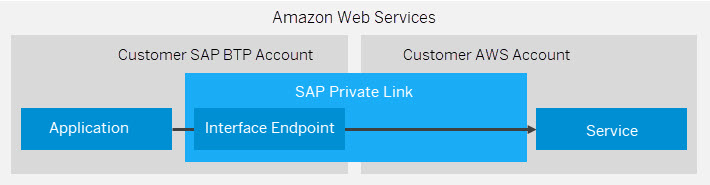

<!-- loio575341947b854a82a9f3ba2bc6b1b6cc -->

# Consume Amazon Web Services in SAP BTP \(Beta\)

SAP Private Link service establishes a private connection between selected SAP BTP services and selected services in your own Amazon Web Service \(AWS\) accounts.

<a name="loio575341947b854a82a9f3ba2bc6b1b6cc__section_ky5_rwr_45b"/>

## Overview

To privately access a service in your AWS accounts, SAP Private Link service creates an AWS interface endpoint and reuses the private link functionality of AWS:

  

> ### Caution:  
> Beta features need to be enabled for your subaccount. For more information, see [Create Subaccount](https://help.sap.com/docs/BTP/65de2977205c403bbc107264b8eccf4b/05280a123d3044ae97457a25b3013918.html) or [Change Subaccount Details](https://help.sap.com/docs/BTP/65de2977205c403bbc107264b8eccf4b/567d4a84bfdc428f8f3640e07261f73a.html).

<a name="loio575341947b854a82a9f3ba2bc6b1b6cc__section_b45_53s_45b"/>

## Prerequisites

-   See [Initial Setup](https://help.sap.com/docs/PRIVATE_LINK/42acd88cb4134ba2a7d3e0e62c9fe6cf/f2dce1d43acb4771beee7304b464041e.html?locale=en-US&version=CLOUD)

-   You have created an Amazon Web Service in the Amazon Web Service Management Console.

<a name="loio575341947b854a82a9f3ba2bc6b1b6cc__section_sqx_fjs_45b"/>

## Supported Services

The following Amazon Web Services can currently be consumed from SAP BTP:

-   [AWS Endpoint Service](aws-endpoint-service-6d1453b.md)

-   [Amazon S3](amazon-s3-b7b0e39.md)

-   [Amazon Simple Queue Service \(SQS\)](amazon-simple-queue-service-sqs-cfad39f.md)

-   [Amazon Simple Notification Service \(SNS\)](amazon-simple-notification-service-sns-a0ba5f2.md)

-   [Amazon Simple Email Service \(SES\)](amazon-simple-email-service-ses-a6d40f2.md)

-   [Amazon Relational Database Service \(RDS\) - Aurora Data API](amazon-relational-database-service-rds-aurora-data-api-cf3528f.md)

<a name="loio575341947b854a82a9f3ba2bc6b1b6cc__section_kzz_tjs_45b"/>

## Tutorial

To learn how to connect the SAP Private Link service to Amazon Web Services, see [Connect SAP Private Link Service to AWS PrivateLink Service](https://developers-qa-blue.wcms-nonprod.c.eu-de-2.cloud.sap/tutorials/private-link-aws.html) .

To learn how to set up SAP Private Link service on Amazon Web Services \(Beta\), see [Set Up SAP Private Link Service on Amazon Web Services \(Beta\)](https://developers.sap.com/tutorials/private-link-service-onboarding-aws.html).

-   **[AWS Endpoint Service](aws-endpoint-service-6d1453b.md "Consume AWS Endpoint Services with SAP Private Link service.")**  
Consume AWS Endpoint Services with SAP Private Link service.
-   **[Amazon S3](amazon-s3-b7b0e39.md "Consume AWS S3 with SAP Private Link service.")**  
Consume AWS S3 with SAP Private Link service.
-   **[Amazon Simple Queue Service \(SQS\)](amazon-simple-queue-service-sqs-cfad39f.md "Consume the Amazon Simple Queue Service (SQS) with SAP Private Link
			service.")**  
Consume the Amazon Simple Queue Service \(SQS\) with SAP Private Link service.
-   **[Amazon Simple Notification Service \(SNS\)](amazon-simple-notification-service-sns-a0ba5f2.md "Consume Amazon Simple Notification Service (SNS) with SAP Private Link
			service.")**  
Consume Amazon Simple Notification Service \(SNS\) with SAP Private Link service.
-   **[Amazon Simple Email Service \(SES\)](amazon-simple-email-service-ses-a6d40f2.md "Consume Amazon Simple Email Service (SES) with SAP Private Link
		service.")**  
Consume Amazon Simple Email Service \(SES\) with SAP Private Link service.
-   **[Amazon Relational Database Service \(RDS\) - Aurora Data API](amazon-relational-database-service-rds-aurora-data-api-cf3528f.md "Consume Amazon Relational Database Service (RDS) - Aurora DATA API with SAP
			Private Link service.")**  
Consume Amazon Relational Database Service \(RDS\) - Aurora DATA API with SAP Private Link service.

