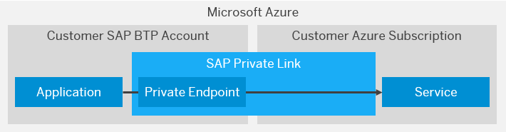

<!-- loioe9cc67716a3a41c9885862661e6c4234 -->

# Consume Azure Services in SAP BTP

SAP Private Link service establishes a private connection between selected SAP BTP services and selected services in your own Microsoft Azure subscriptions.

<a name="loioe9cc67716a3a41c9885862661e6c4234__section_mpr_tmz_cpb"/>

## Overview

To privately access a service in your Azure subcription, SAP Private Link service creates a private endpoint and reuses the private link functionality of Azure:

  

<a name="loioe9cc67716a3a41c9885862661e6c4234__section_sll_bjz_cpb"/>

## Prerequisites

-   See [Initial Setup](../initial-setup-f2dce1d.md).

-   You have created a Microsoft Azure service in the Azure Portal.

<a name="loioe9cc67716a3a41c9885862661e6c4234__section_slk_1jz_cpb"/>

## Supported Services

The following Azure services can currently be consumed from SAP BTP:

-   [Azure Private Link Service](azure-private-link-service-e8bc0c6.md)

-   [Azure Database for MariaDB](azure-database-for-mariadb-862fa29.md)

-   [Azure Database for MySQL](azure-database-for-mysql-5c70499.md)

<a name="loioe9cc67716a3a41c9885862661e6c4234__section_zg3_cjz_cpb"/>

## Tutorial

To learn how to connect the SAP Private Link service to Microsoft Azure, see [Connect SAP Private Link Service to Microsoft Azure Private Link Service with Cloud Foundry CLI](https://developers.sap.com/tutorials/private-link-microsoft-azure.html).

-   **[Azure Private Link Service](azure-private-link-service-e8bc0c6.md "Consume Azure Private Link service with SAP Private Link service . ")**  
Consume Azure Private Link service with SAP Private Link service.
-   **[Azure Database for MariaDB](azure-database-for-mariadb-862fa29.md "Consume Azure Database for MariaDB with SAP Private Link service . ")**  
Consume Azure Database for MariaDB with SAP Private Link service.
-   **[Azure Database for MySQL](azure-database-for-mysql-5c70499.md "Consume Azure Database for MySQL with SAP Private Link service . ")**  
Consume Azure Database for MySQL with SAP Private Link service.

