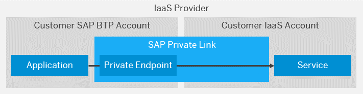

<!-- loio3eb3bc7aa5db4b5da9dcdbf8ee478e52 -->

<link rel="stylesheet" type="text/css" href="css/sap-icons.css"/>

# What Is SAP Private Link Service?

Provide private connectivity to selected services. 

SAP Private Link service establishes a private connection between selected SAP BTP services and selected services in your own IaaS provider accounts. By reusing the private link functionality of our partner IaaS providers, it lets you access your services through private network connections to avoid data transfer via the public Internet.

If you are running your applications or services on SAP BTP and you want to communicate to another service that runs in your own Hyperscaler account, the communication between these two services should stay within the Hyperscaler backbone network and should not be routed through the public internet. By using the Private Link service, you establish a private communication channel where transferred data stays within the same Hyperscaler backbone network. Therefore, attack vectors are minimized and a secure communication is ensured. This is essential when it comes to transferring business data from one to another because any security breach can cause major damage to your business in general.

> ### Note:  
> The Private Link service currently only supports the SAP BTP Cloud Foundry runtime and Kyma runtime.
> 
> For the future, we are evaluating the integration in other services such as Cloud Integration, SAC, DWC, HANA Cloud, and Connectivity Service/Cloud Connector.

> ### Tip:  
> The English version of this guide is open for contributions and feedback using GitHub. This allows you to get in contact with responsible authors of SAP Help Portal pages and the development team to discuss documentation-related issues. To contribute to this guide, or to provide feedback, choose the corresponding option on SAP Help Portal:
> 
> -   :pencil2: : Contribute to a document in the guide. This option opens a pull request on GitHub.
> 
> -    Feedback: Provide feedback about a document in the guide. This option opens an issue on GitHub.
> 
> 
> To use these options, a GitHub account is required.
> 
> More information:
> 
> -   [**Contribution Guidelines**](https://help.sap.com/docs/open-documentation-initiative/contribution-guidelines/readme.html)
> 
> -   [Introduction Video: Open Documentation Initiative](https://www.youtube.com/watch?v=DwxrZ6ET3Yc)
> -   [Blog Post: **Introducing the Open Documentation Initiative**](https://blogs.sap.com/2021/05/20/introducing-the-open-documentation-initiative/)

## Features

<dl>
<dt><b>

Access services privately 

</b></dt>
<dd>

Enable access to private service endpoints and avoid public endpoints when connecting to selected service instances across account boundaries.

</dd><dt><b>

Transfer data privately 

</b></dt>
<dd>

Transfer data over private networks and avoid data transfer over the public Internet when connecting to selected service instances across account boundaries.

</dd>
</dl>

<a name="loio3eb3bc7aa5db4b5da9dcdbf8ee478e52__section_mkl_rrc_zsb"/>

## Environment

This service is available in the Cloud Foundry environment.

## Overview

To privately access a service in your IaaS Provider account, SAP Private Link service creates a private endpoint and reuses the private link functionality of the IaaS provider:

For more information, see [Concepts](concepts-6c7c8a9.md).

## Tools

-   **SAP BTP cockpit**: Use the SAP BTP cockpit to create service instances and application bindings.

-   **Cloud Foundry command line interface**: Use the Cloud Foundry command line interface to create service instances and application bindings. For more information, see [Working with the Cloud Foundry Command Line Interface](https://help.sap.com/viewer/65de2977205c403bbc107264b8eccf4b/Cloud/en-US/2f1d4abd0f9f4760a301f43513d2efa6.html)

-   **IaaS provider tools**

